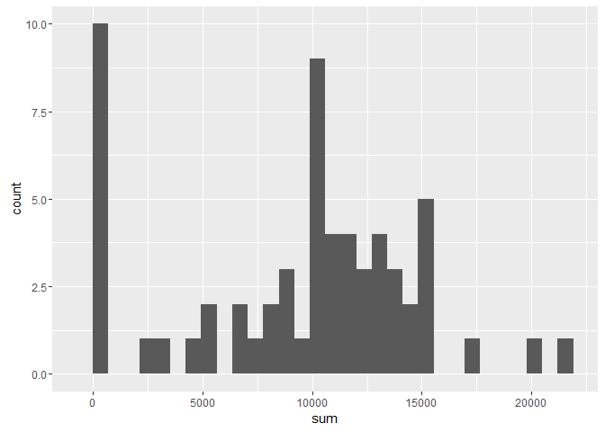
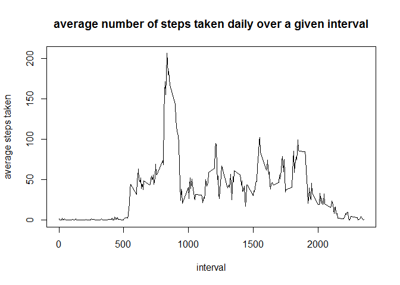
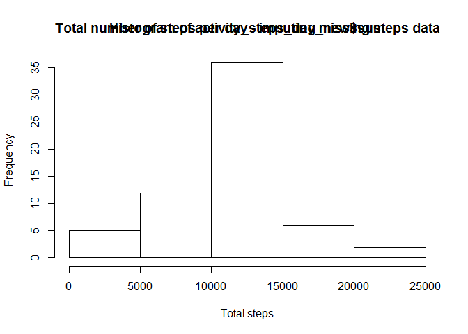
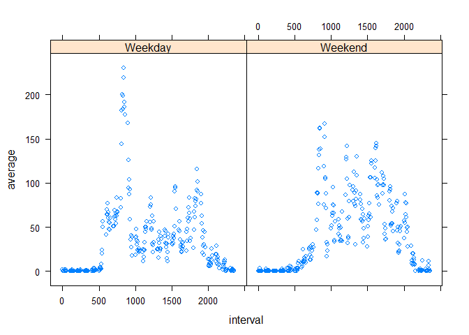

This is an R Markdown document. Markdown is a simple formatting syntax
for authoring HTML, PDF, and MS Word documents. For more details on
using R Markdown see <http://rmarkdown.rstudio.com>.

When you click the **Knit** button a document will be generated that
includes both content as well as the output of any embedded R code
chunks within the document. You can embed an R code chunk like this:

    setwd("/Users/Murali/Documents/Coursera/Course5/Week1/RepData_PeerAssessment1/")

    # unzipped the files manually in the .zip file 

    #1
    #1a 
    activity <- read.csv("activity.csv", sep=",", header=T)
    names(activity)

    ## [1] "steps"    "date"     "interval"

    dim(activity)

    ## [1] 17568     3

    str(activity)

    ## 'data.frame':    17568 obs. of  3 variables:
    ##  $ steps   : int  NA NA NA NA NA NA NA NA NA NA ...
    ##  $ date    : Factor w/ 61 levels "2012-10-01","2012-10-02",..: 1 1 1 1 1 1 1 1 1 1 ...
    ##  $ interval: int  0 5 10 15 20 25 30 35 40 45 ...

    class(activity$date)

    ## [1] "factor"

    #1b
    # converting date factor to date
    activity$date <- as.Date(activity$date, "%Y-%m-%d")
    str(activity)

    ## 'data.frame':    17568 obs. of  3 variables:
    ##  $ steps   : int  NA NA NA NA NA NA NA NA NA NA ...
    ##  $ date    : Date, format: "2012-10-01" "2012-10-01" ...
    ##  $ interval: int  0 5 10 15 20 25 30 35 40 45 ...

    #2
    library(dplyr)

    ## 
    ## Attaching package: 'dplyr'

    ## The following objects are masked from 'package:stats':
    ## 
    ##     filter, lag

    ## The following objects are masked from 'package:base':
    ## 
    ##     intersect, setdiff, setequal, union

    activity_date <- group_by(activity, date)
    dim(activity_date)

    ## [1] 17568     3

    #2a
    # total number of steps per day - IGNORING MISSING STEPS INFO
    activity_steps_day <- summarize(activity_date, sum=sum(steps, na.rm=TRUE))
    activity_steps_day

    ## Source: local data frame [61 x 2]
    ## 
    ##          date   sum
    ##        (date) (int)
    ## 1  2012-10-01     0
    ## 2  2012-10-02   126
    ## 3  2012-10-03 11352
    ## 4  2012-10-04 12116
    ## 5  2012-10-05 13294
    ## 6  2012-10-06 15420
    ## 7  2012-10-07 11015
    ## 8  2012-10-08     0
    ## 9  2012-10-09 12811
    ## 10 2012-10-10  9900
    ## ..        ...   ...

    #2b
    library(ggplot2)
    qplot(sum, data=activity_steps_day)

    ## `stat_bin()` using `bins = 30`. Pick better value with `binwidth`.

<!-- -->

    #2c
    summary(activity_steps_day$sum)

    ##    Min. 1st Qu.  Median    Mean 3rd Qu.    Max. 
    ##       0    6778   10400    9354   12810   21190

    # mean steps per day  = 9,354
    # median steps per day = 10,395

    #3 
    activity_interval <- group_by(activity, interval)
    dim(activity_interval)

    ## [1] 17568     3

    #3a
    # average number of steps per interval
    activity_steps_interval <- summarize(activity_interval, average=mean(steps, na.rm=TRUE))
    activity_steps_interval

    ## Source: local data frame [288 x 2]
    ## 
    ##    interval   average
    ##       (int)     (dbl)
    ## 1         0 1.7169811
    ## 2         5 0.3396226
    ## 3        10 0.1320755
    ## 4        15 0.1509434
    ## 5        20 0.0754717
    ## 6        25 2.0943396
    ## 7        30 0.5283019
    ## 8        35 0.8679245
    ## 9        40 0.0000000
    ## 10       45 1.4716981
    ## ..      ...       ...

    dim(activity_steps_interval)

    ## [1] 288   2

    summary(activity_steps_interval$average)

    ##    Min. 1st Qu.  Median    Mean 3rd Qu.    Max. 
    ##   0.000   2.486  34.110  37.380  52.830 206.200

    plot(activity_steps_interval$interval, activity_steps_interval$average, data = activity_steps_interval, xlab="interval", ylab="average steps taken", type="n")

    ## Warning in plot.window(...): "data" is not a graphical parameter

    ## Warning in plot.xy(xy, type, ...): "data" is not a graphical parameter

    ## Warning in axis(side = side, at = at, labels = labels, ...): "data" is not
    ## a graphical parameter

    ## Warning in axis(side = side, at = at, labels = labels, ...): "data" is not
    ## a graphical parameter

    ## Warning in box(...): "data" is not a graphical parameter

    ## Warning in title(...): "data" is not a graphical parameter

    title("average number of steps taken daily over a given interval")
    lines(activity_steps_interval$interval, activity_steps_interval$average)

<!-- -->

    # abline(h=max(activity_steps_interval$average), col="red")

    #3b 
    # interval with maximum number of steps on average

    filter(activity_steps_interval, average==max(average)) # average = 206.1698, interval = 835

    ## Source: local data frame [1 x 2]
    ## 
    ##   interval  average
    ##      (int)    (dbl)
    ## 1      835 206.1698

    #4 dealing with missing values

    #4a
    colSums(is.na(activity)) 

    ##    steps     date interval 
    ##     2304        0        0

    #2,304 missing values for steps, date and interval columns had no missing values

    #4b impute steps=NA with average steps for that interval
    #4c, there are 288 intervals
    activity_new <- merge(activity, activity_steps_interval, by.activity=interval,
    by.activity_steps_interval=interval)
    dim(activity_new)

    ## [1] 17568     4

    #head(activity_new, 100)

    activity_new <- activity_new %>%
          mutate(steps = ifelse(is.na(steps),average,steps)) # replace steps only if NA
    activity_new <- activity_new[ , 1:3]
    dim(activity_new)

    ## [1] 17568     3

    #head(activity_new, 61)

    #4d
    activity_date_new <- group_by(activity_new, date)
    dim(activity_date_new)

    ## [1] 17568     3

    # total number of steps per day - IMPUTING MISSING STEPS INFO
    activity_steps_day_new <- summarize(activity_date_new, sum=sum(steps))
    activity_steps_day_new

    ## Source: local data frame [61 x 2]
    ## 
    ##          date      sum
    ##        (date)    (dbl)
    ## 1  2012-10-01 10766.19
    ## 2  2012-10-02   126.00
    ## 3  2012-10-03 11352.00
    ## 4  2012-10-04 12116.00
    ## 5  2012-10-05 13294.00
    ## 6  2012-10-06 15420.00
    ## 7  2012-10-07 11015.00
    ## 8  2012-10-08 10766.19
    ## 9  2012-10-09 12811.00
    ## 10 2012-10-10  9900.00
    ## ..        ...      ...

    hist(activity_steps_day_new$sum, xlab="Total steps")
    title("Total number of steps per day - imputing missing steps data")

<!-- -->

    summary(activity_steps_day_new$sum)

    ##    Min. 1st Qu.  Median    Mean 3rd Qu.    Max. 
    ##      41    9819   10770   10770   12810   21190

    # mean steps per day  = 10,770 on imputing increased from 9,354
    # median steps per day = 10,770 on imputing increased from 10,395
    # both mean and median increased. mean increased by more

    #5 
    #5a
    activity_new <- mutate(activity_new, day_type=factor(1*(weekdays(date) %in% c("Saturday","Sunday")), 
    labels=c("Weekday","Weekend")))
    dim(activity_new)

    ## [1] 17568     4

    head(activity_new)

    ##   interval    steps       date day_type
    ## 1        0 1.716981 2012-10-01  Weekday
    ## 2        0 0.000000 2012-11-23  Weekday
    ## 3        0 0.000000 2012-10-28  Weekend
    ## 4        0 0.000000 2012-11-06  Weekday
    ## 5        0 0.000000 2012-11-24  Weekend
    ## 6        0 0.000000 2012-11-15  Weekday

    summary(activity_new$day_type)

    ## Weekday Weekend 
    ##   12960    4608

    #5b
    activity_new_day_type <- group_by(activity_new, day_type, interval)
    activity_new_steps <- summarize(activity_new_day_type, average=mean(steps))
    dim(activity_new_steps)

    ## [1] 576   3

    head(activity_new_steps)

    ## Source: local data frame [6 x 3]
    ## Groups: day_type [1]
    ## 
    ##   day_type interval    average
    ##     (fctr)    (int)      (dbl)
    ## 1  Weekday        0 2.25115304
    ## 2  Weekday        5 0.44528302
    ## 3  Weekday       10 0.17316562
    ## 4  Weekday       15 0.19790356
    ## 5  Weekday       20 0.09895178
    ## 6  Weekday       25 1.59035639

    library(lattice)
    xyplot(average~interval | day_type , data = activity_new_steps, geom="lines")

<!-- -->
